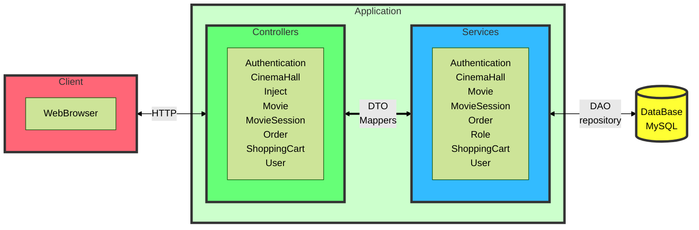

# Cinema-app &middot;
[](https://semver.org)

This is an example of service for buying tickets to the cinema.<br> 
Its gives a user opportunity to choose movie, add tickets to the shopping cart 
and complete the order.<br>
This is backend part of application. 

#### It supports such functionality as:
- Registration of new user with role USER by default
- Login user by entering email and password
- Logout to log with another user
- Adding new movies and cinema halls
- Adding new movie sessions, which containes the movie, the cinema hall and DateTime stamp
- Buying new tickets by adding them to user shopping cart
- Completing order with tickets
- Get history for logged user

### Cinema application contains several controllers
- Authentication
- Cinema Hall
- Movie
- Movie Session
- Order
- ShoppingCart
- User
- Inject (additional controller to inject data to DB for testing application)

## Developing

### Diagram of application



### Technologies used:
- Spring Framework
- Spring Security
- JDBC
- MySQL 8
- Servlet
- JSTL
- Tomcat 9
- Maven

### Running project on local machine

- Clone this project into your local folder 
- Open the project in an IDE
- Install and configure Local Tomcat Server (set "/" in Deployment tab - cinema-app:war exploded)
- After run the application you have two user and one admin which you can use to logging
- Then default Spring login page will accrue
- To test API (to make HTTP query) I use Postman software

#### Setting up local DataBase
- Download and install MySQL
- To configure connection of project to database fill free to edit db.properties (src/main/resources/db.properties)

```lombok.config
#MySQL properties
db.driver=YOUR_DRIVER
db.url=YOUR_DATABASE_URL
db.user=YOUR_USERNAME
db.password=YOUR_PASSWORD
```
#### where:
<YOUR_DRIVER> - JDBC Driver (for example: com.mysql.jdbc.Driver) <br>
<YOUR_DATABASE_URL> - URL to Database with name of database 
(for example: jdbc:mysql://localhost:8080/cinemaDB) <br>
<YOUR_USERNAME> - username to get permission to read and write to database <br>
<YOUR_PASSWORD> - password for YOUR_USERNAME <br>

Also, you need to configure local server. I'd use Tomcat 9.0.50 server.<br>
If you use IntelliJ IDEA here is good step-by-step tutorial: https://youtu.be/JIRDMGJ66SE.

# P.S.

Some features I learned while programming this project:
- Using Spring Framework to create backend application with DataBase
- Using Spring Security for authentication and authorization users
- Configure Spring Security to give permissions using roles of users 
- Implement storing users in DB
- Working with JDBC and MySQL database
- Using JSON to work with application
- Configuring controllers
- Project built with SOLID principles
- Using Session to store some information
- Using Dependency Injection for creating instances
- Working with Postman API Platform 
- Creating README.md file
- Creating diagrams using [mermaid](https://mermaid-js.github.io/mermaid/#/) tool

